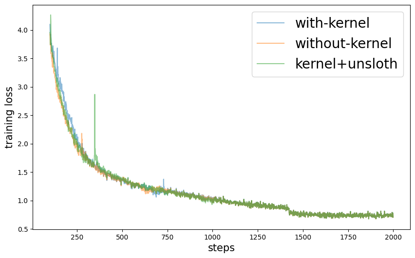
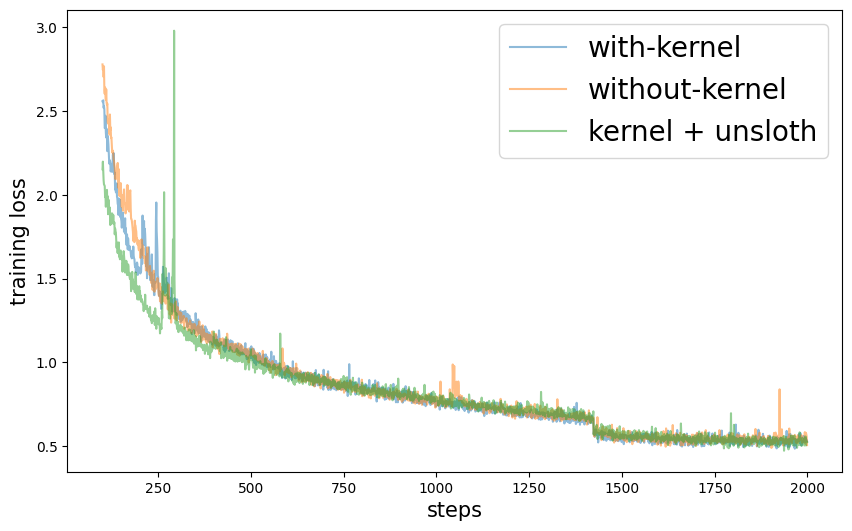

# 快速使用
## 介绍
- 一行“import”直接加速huggingface上模型的训练，其它代码无需任何更改。主要还是分享下triton的示例教学，unsloth的优化比我做得更好，如果大家代码熟练的话，还是建议去使用unsloth框架。训练再大些的模型（如14B及以上）建议上deepspeed或megatron。
## packages
- 建议使用最新的版本
```bash
pip install --upgrade transformers
pip install --upgrade triton
```
## 使用方法1
- 在该目录下运行文件
```bash
from mdy_triton.replace_kernel import *
# your code
```
## 使用方法2
```bash
pip install .
from mdy_triton.replace_kernel import *
# your code
```
- 默认替换所有支持模型的算子，除了非HF官方的模型。如果只替换指定模型可以运行如下：
```bash
from mdy_triton.replace_kernel.qwen2 import trigger
# your code
```

# 接口
- 所有加速算子的接口都写在了“mdy_triton.core”目录下的文件中，都写了注释，并配了example
- 与huggingface中的模型代码无缝衔接，无需任何修改，直接使用
- 目前个人完成的算子如下(速度测试在04-08的文件中，欢迎测试)：
    - rmsnorm
        - forward加速10倍+，backward加速10倍+
    - add_rmsnorm
        - 在rmsnorm的基础上进一步提速30%
    - fused_apply_rope
        - forward加速9倍，backward提速6倍
    - fused_silu
        - up和gate不是由一个Linear映射过来的，forward和backward加速接近2倍；由一个矩阵映射过来，forward和backward都加速4倍左右
- 非自己完成：
    - fast_cross_entropy
        - unsloth的算子，我也没做详细测试，结论是速度快，省显存，模型越小效果越明显
- 目前模型kernel替换，写了如下：
    - llama
    - qwen2
    - qwen2_vl
    - mistral
    - glm4
- 如果还有常用的模型欢迎留言，我会继续添加。如果后续反响不错的话，我会添加更多的算子，比如bert架构的。
- 其中glm4不是HF内置的模型，需要添加路径进入导入，具体参考示例，建议直接修改模型权重路径下的modeling_chatglm.py，之后直接可以使用AutoModelxxxx进行导入。以上模型我都解决了梯度累积偏差的bug，可以放心使用Trainer进行训练
# 声明
- 算loss的算子是直接copy的unsloth的，不是自己写的。做了简单修改，比如原始代码的device有问题，并在forward代码中进行简单题调整。其它算子都是自己写的，rope的翻转方式借鉴了unsloth

# 教学
- 一共写了8个triton示例，01-08， 01是入门，02-03是简单应用，04-08算是实战吧。建议看完01，02去看看官方的前几个示例，也许会豁然开朗。
- 如果学习triton，建议先详细看“01-easy-example.ipynb”中的示例，我把常用的指针操作都写了注释，之后的示例，没有什么注释了
- 其中07是个失败的例子，但是并没有删，还有04前后写了5个版本，记录了我是如何一步一步进行优化的，感觉这些经验更重要

# 加速效果
- 加速效果均使用09中的代码进行测试，无optimizer干扰，device: A800 80G
- 一个结论就是模型越小，加速效果越明显，其中unsloth的loss算子对小尺寸模型非常友好，因为小模型的forward非常快，大多数时间在计算loss了，比如qwen2系列模型，不管模型多大，vocab_size都是15w，计算loss的复杂度都是一样的，随着模型尺寸变大，收益越来越小。


# 模型训练
- 根据自己需要适当添加额外参数，主要参数直接在“train.sh”中修改即可，目前主要实现了sft，读取messgaes的json数据
## 启动命令
```bash
bash train.sh --deepspeed --replace_kernel
```
- 训练日志和配置文件以及dataset都在“train_model”目录下，“plot.ipynb”查看详细训练loss
## Qwen2 0.5B训练loss
- bs=256，micro_bs=16, seq_len=2048, zero2, 8*A800，训练加加速84%，比前面的无opeimizer还高。单卡显存54G
- 不使用unsloth的loss算子，micro_bs=16，直接爆显存，我猜测是torch的corss_entropy的算子在计算过程中，存了大量中间结果，vocab_size太大，很占显存，而小尺寸的模型中间结果其实不怎么占显存，因此开不了大的batch_size。因此这个算子是真神！对小模型太关键了。

## llama3 1B训练loss
- 配置和上面一样，micro_bs同样可以开到16。训练llama的时候，我发现loss有时非常异常，有一次训练最终收敛效果不太好，可以看看我的训练日志，图中是较好的一次了。主要是因为unsloth的loss算的误差有点大，可以在“09-test-kernel-speed.ipynb”中进行测试，最终的梯度差的比较多，如果崩了，建议小学习率或者换个种子。训练加速45%
